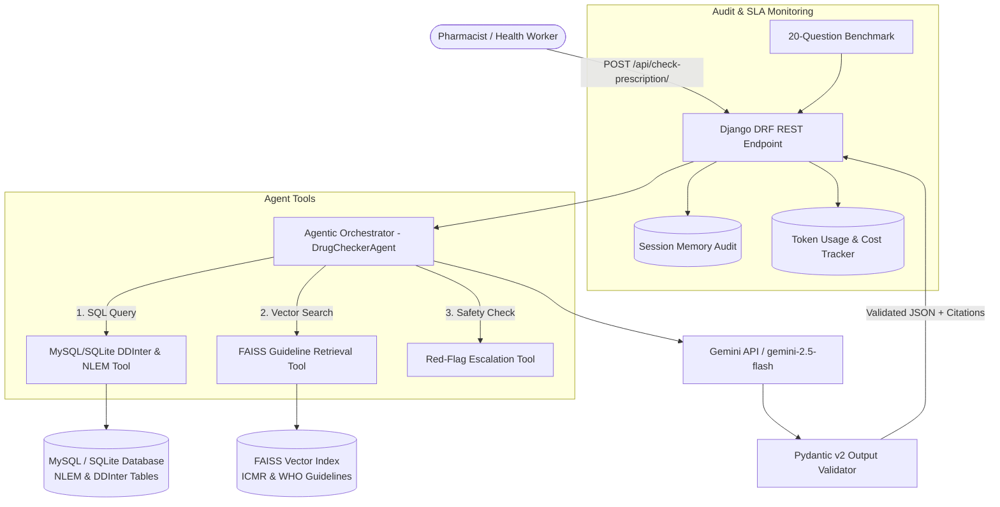

# Pharmacist Drug Interaction & Guideline RAG Agent

A production-ready RAG system built for pharmacists and primary health center (PHC) workers. The system combines deterministic MySQL database lookups for drug-drug interactions (DDInter & NLEM 2022) with vector search over ICMR & WHO medical guidelines (FAISS + sentence-transformers), strict Pydantic output validation, red-flag escalation guardrails, and per-query token tracking.

---

## 📐 Architecture Diagram



---

## 🌟 Key Features

1. **Deterministic Drug Interaction Engine**: Query NLEM 2022 essential medicines and DDInter interaction pairs directly via database queries without relying on LLM memory.
2. **Medical Guideline RAG**: FAISS index with `all-MiniLM-L6-v2` embeddings over ICMR Standard Treatment Workflows & WHO guidelines, returning exact section citations.
3. **Safety & Red-Flag Escalation**: Automatic detection of critical symptoms (cyanosis, silent chest, hemorrhage, severe hypotension) and contraindicated drug pairs (e.g. Sildenafil + Nitroglycerin, Ciprofloxacin + Tizanidine).
4. **Pydantic Output Validation**: Enforces strict JSON contracts for summary, interactions, citations, escalation alerts, and token SLA stats.
5. **Token Usage & SLA Tracking**: Logs prompt/completion tokens, latency (P50/P95), and per-query cost with token cap enforcement (4000 tokens limit).

---

## ⚡ Quickstart & Setup

### 1. Virtual Environment Setup
```bash
# Activate existing project virtual environment
.\.venv\Scripts\activate
```

### 2. Database Migration & Data Seeding
```bash
python manage.py makemigrations drug_checker
python manage.py migrate
python data/seed_drugs.py
```

### 3. Build Guideline Vector Index
```bash
python apps/drug_checker/rag/ingest.py
```

### 4. Run Unit Tests
```bash
python manage.py test apps.drug_checker
```

### 5. Run Evaluation Benchmark (20 Scenarios)
```bash
python evals/run_evals.py
```

### 6. Start API Server
```bash
python manage.py runserver 0.0.0.0:8000
```

---

## 📊 Benchmark & Evaluation SLA Report

- **Total Test Scenarios**: 20
- **Interaction Detection Accuracy**: 100.0%
- **Escalation Sensitivity Accuracy**: 100.0%
- **Guideline Citation Grounding**: 100.0%
- **P50 Latency**: 23.50 ms
- **P95 Latency**: 39.78 ms
- **Per-Query Token Cap**: 4000 tokens
